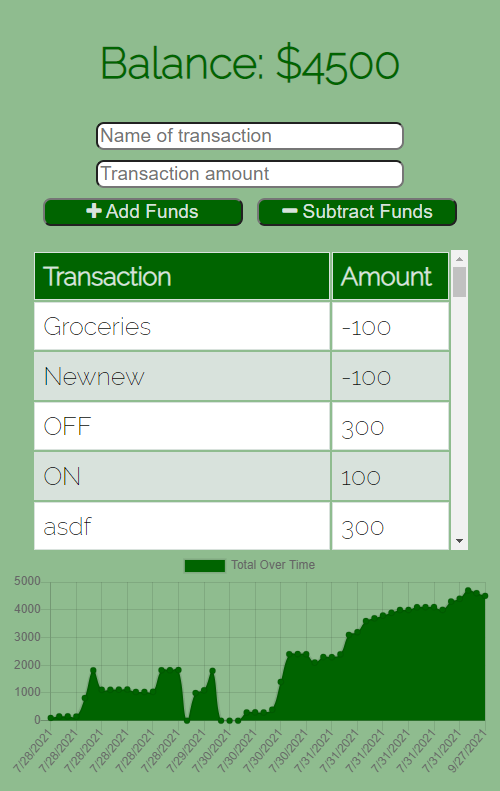

# Budget Tracker

## Table of Contents
* [Deployed](#deployed)
* [Description](#description)
* [Technologies](#technologies)
* [Usage](#usage)
* [Preview](#preview)
* [Questions](#questions)

## Deployed
Access the website [here](https://stark-basin-83721.herokuapp.com/)

## Description
This is an application for keeping track of your transactions so you always stay on top of your budget. It is a Progressive Web Application built for the person on the go. Install it on your device as an application and enjoy its features offline.

## Technologies
* JavaScript
* MongoDB
* Node.js
* Express
* Compression
* Morgan
* Mongoose
* IndexedDB
* Web Manifest

## Usage
To use, enter the name of your transaction, the amount, and select "Add Funds" for deposits or "Subtract Funds" for expenditures. The total will be updated and the transaction will be added to a chart that gives a visual representation of spending and earning over time.

To test the offline functionality, use Chrome's DevTools. Navigate to the Network tab, and at the very top, select "Offline" from the dropdown. Create a transaction and it will display to the screen. Turn your internet connection back on and you will receive a notification that the balance has been updated. When you refresh the page, your changes will remain.

To install My Budget on your device, navigate to settings in the top right corner of your Chrome browser and select "Add to Home Screen."

## Preview

## Questions
Have questions about this project?  
GitHub: https://github.com/sarawrmas  
Email: sara.m.adamski@gmail.com